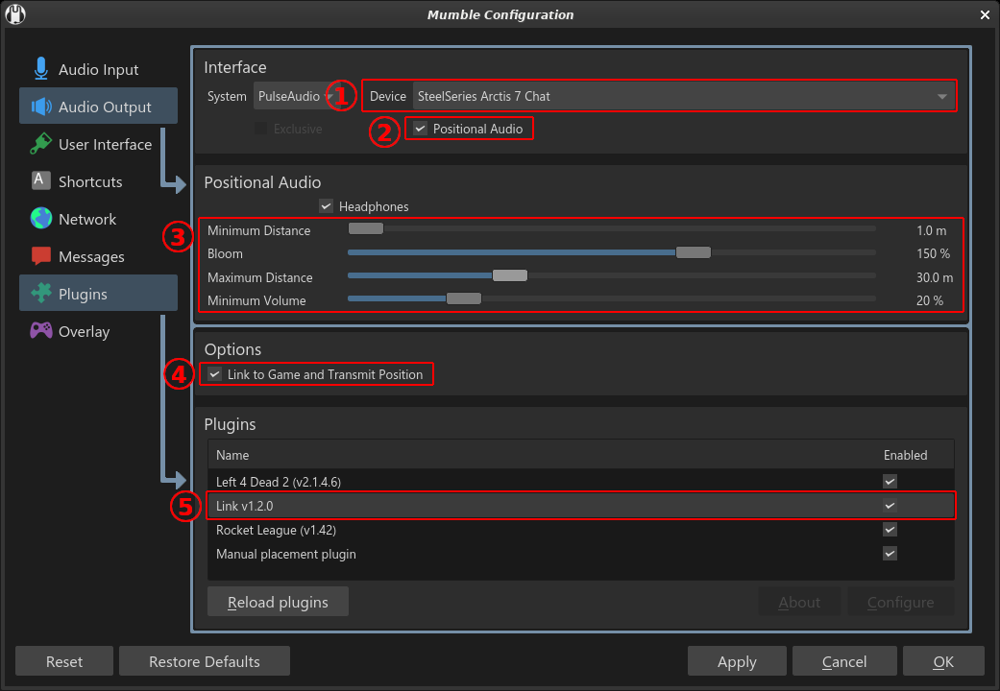

# MumbleLink

.. is a *[Vintage Story]* mod which enables *[Mumble]* positional audio through its Link plugin.

When using the mod and connected to a multiplayer server, players who are in the same voice chat channel are able to hear one another spatially in 3D, relative to their avatars' positions in-game.

This mod is only required on clients to function, but requires the separate voice chat program [Mumble], and a Mumble server to connect to. Headphones highly recommended.

[Vintage Story]: https://vintagestory.at/
[Mumble]: https://www.mumble.info/

## Download / Installation

Available right here through [GitHub Releases].

To install, start the game and go to the *Mod Manager* in the main menu. There you can find a button labeled *Open Mod Folder* that will open said folder in your file explorer. Simply put the `.zip` file you downloaded into here **without extracting it**.

[GitHub Releases]: https://github.com/copygirl/MumbleLink/releases

## Configuration

To enable positional audio in Mumble:

- Check the ② *Positional Audio* checkbox.
- Ensure that ④ *Link to Game and Transmit Position* is checked and the ⑤ *Link* plugin is enabled.
- Ensure that you're using a stereo ① audio output device. Headphones recommended.

Notes on configuring ③ *Positional Audio* further:

- **Minimum Distance:** Below this distance, the volume of other players will be at 100%.
- **Bloom:** I believe this has something to do with the distance falloff curve.
- **Maximum Distance:** Above this distance, the volume of other players will be at *Minimum Volume*.
- **Minimum Volume:** The quietest you will ever hear other players. Use 100% to disable distance falloff altogether. Use 0% for maximum immersion - being unable to hear players when they're too far away.

These settings will only affect how **you** hear others. For best effect, make sure that everyone is using the same values. I recommend leaving *Minimum Distance* and *Bloom* alone and adjusting the other two based to your group's preferences.

## Credits

This mod was initially created over the course of 2 days with the help of my amazing friend **[Nikky]** and overwhelming emotional support of those who watched my [Twitch] stream.

[Nikky]: https://github.com/NikkyAI
[Twitch]: https://twitch.tv/copygirl
